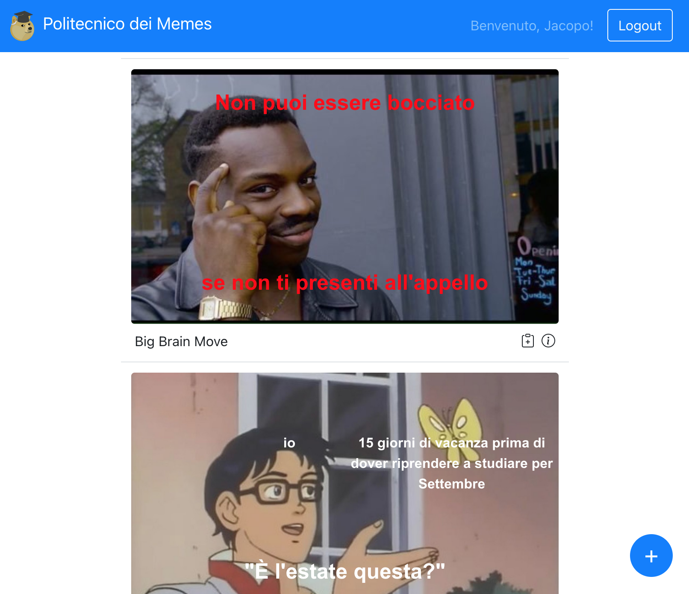
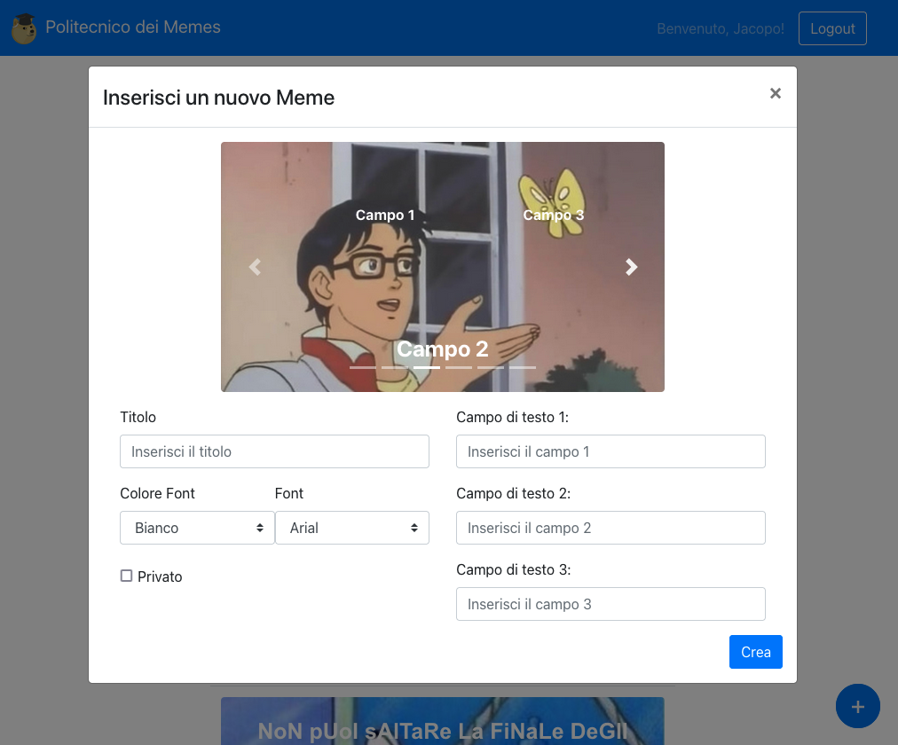

# "Meme Generator": a web application

## Application goals
The primary aim of the project is to develop a web application based on React and Bootstrap, along with javascript, capable to create and display memes. 
A “meme” is an image on which a funny text is superimposed.
<br><br> In the homepage the meme wall is displayed, showing the memes created by other users.  A non-logged in user can only see the public ones, while a registered user can see both the public and private meme wall, together with his own creations.  A registered user can also create memes, choosing from a selection of images, superimposing text in the fields provided.  Different colors and fonts are available.  Once you have created a meme, you can decide whether to share it on the public or only in the private wall.  A meme, if it is owned by the user, can be edited. You can also duplicate other users' memes and change the text to create your own meme based on theirs.
<br><br> The entire application was developed also using npm, so it can be installed just using “npm install” in both client and server folder. 

meme

## Screenshots

<p align="center">
  <br/>
  <em>The memes wall on the homescreen.</em>
</p>

<p align="center">
  <br/>
  <em>The pop-up to add a new meme.</em>
</p>

## Technical specifications

### React Client Application Routes

- Route `/`: Main page. It renders all the components like navbar, list of memes with the buttons to copy, delete or get info and a big blue button to add a new meme.
- Route `/login`: Login page. Given an email and a password it calls the functions to perform the login of an user, if them are correct. It also update the props in the main page to give info about the user.

### API Server

#### Meme Management

- GET `/api/public_memes`
  - Description: get the list of only public memes
  - Request body: _none_
  - Response: `200` (success)
  - Error response: `404` (not found), `500` (generic error)
  - Response body: Array of objects, each describing one meme:
``` JSON
[{
    "id": 1,
    "img": 2,
    "title": "Tristezza su meme, 2021",
    "creator": 2,
    "creator_name": "Erika",
    "private": 0,
    "fields": 3,
    "field1": "io",
    "field2": "È l'estate questa?",
    "field3": "15 giorni di vacanza prima di dover riprendere a studiare per Settembre",
    "color": "bianco",
    "font": "arial",
}]
```

- GET `/api/all_memes`
  - Description: get the full list of memes
  - Request body: _none_
  - Response: `200` (success)
  - Error response: `404` (not found), `500` (generic error)
  - Response body: Array of objects, each describing one meme:
``` JSON
[{
    "id": 0,
    "img": 0,
    "title": "Big Brain Move",
    "creator": 3,
    "creator_name": "Federico",
    "private": 1,
    "fields": 2,
    "field1": "Non puoi essere bocciato",
    "field2": "se non ti presenti all'appello",
    "field3": "",
    "color": "rosso",
    "font": "arial",
}]
```

- GET `/api/images_list`
  - Description: get the list of all meme image backgrounds with path and fields
  - Request body: _none_
  - Response: `200` (success)
  - Error response: `404` (not found), `500` (generic error)
  - Response body: Array of objects, each describing one image:
``` JSON
[{
    "id": 0,
    "path": "/templates/0.jpg",
    "fields_img": 2,
    "field1_img": "top-center",
    "field2_img": "bottom-center",
    "field3_img": null
}]
```

- POST `/api/all_memes`
  - Description: add a new meme to the memes
  - Request body: description of the object to add
  - Response: `201` (success)
  - Error response: `503` (generic error)
  - Response body: the object as represented in the database
``` JSON
[{
    "id": 6,
    "img": 0,
    "title": "Big Brain Move - Copia",
    "creator": 1,
    "creator_name": "Jacopo",
    "private": 1,
    "fields": 2,
    "field1": "Non puoi essere bocciato",
    "field2": "se non ti presenti all'appello",
    "field3": "",
    "color": "rosso",
    "font": "arial",
}]
```

- DELETE `/api/memes/:id`
  - Description: delete an existing meme of the logged user
  - Request body: credentials of the user who is trying to login
  - Response: `200` (success)
  - Error response: `503` (generic error)
  - Response body: an empty object

#### User Management

- POST `/api/session`
  - Description: authenticate the user who is trying to login
  - Request body: description of the object to add
  - Response: `201` (success)
  - Error response: `500` (generic error), `401` (login failed)
  - Response body: authenticated user
``` JSON
[{
    "id": 1,
    "email": "jacopo@polimeme.it",
    "name": "Jacopo",
    "hash": "..."
}]
```

- DELETE `/api/sessions/current`
  - Description: logout current user
  - Request body: _None_
  - Response: `200` (success)
  - Error response: `500` (generic error), `401` (unauthorized user)
  - Response body: _None_

- GET `/api/sessions/current`
  - Description: check if current user is logged in and get the data
  - Request body: _None_
  - Response: `200` (success)
  - Error response: `500` (generic error), `401` (unauthorized user)
  - Response body: authenticated user
``` JSON
[{
    "id": 1,
    "email": "jacopo@polimeme.it",
    "name": "Jacopo",
    "hash": "..."
}]
```

### Database Tables

- Table `images` - contains id, path, fields_img, field1_img, field2_img, field3_img
- Table `meme_table` - contains meme_id, image_id, meme_title, meme_creator, meme_creator_name, meme_visibility, meme_fields, field_1, field_2, field_3, color, font
- Table `users` - contains id, email, name, hash


### Main React Components

- `MyNavbar` (in `Main.js`): component navbar with logo and link to login/logout
- `LoginForm` (in `Login.js`): login form to perform authentication
- `MemeTable` (in `MemeTable.js`): component to print meme list in the homepage, with buttons to copy, get info or delete a meme
- `CopyPopup` (in `CopyMemes.js`): component to copy an existing meme
- `InfoPopup` (in `InfoMemes.js`): component to get information on an existing meme
- `NewMemeButton` (in `Buttons.js`): component with a button to start create a new meme
- `InputPopup` (in `InputMemes.js`): component to create a new meme
- `MemeText` (in `MemesPosition.js`): component to place text over the image to create the graphic of a

### Users Credentials

- email: jacopo@polimeme.it, password: 123456 
  - Created memes with id 2, 5 and copied the one with id 6 from Erika
- email: erika@polimeme.it, password: 654321
  - Created memes with id 1, 4 and copied the one with id 7 from Federico
- email: federico@polimeme.it, password: 123456
  - Created memes with id 0, 3 and copied the one with id 8 from Erika
